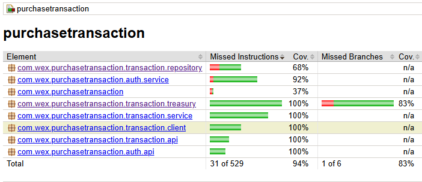

# Purchase Transaction API

A Spring Boot 3 + Java 21 REST API for storing purchase transactions and retrieving them with currency conversion based on official U.S. Treasury exchange rates.

This project was designed and implemented as a production-oriented service, while remaining easy to run and evaluate locally, with infrastructure concerns intentionally scoped to the application boundary.

## Features

### Functional
- **Store purchase transactions** with unique identifiers
- **Retrieve transactions converted to a target currency** based on U.S. Treasury exchange rates
- **Exchange rate resolution** using a configurable historical lookup window

### Cross-Cutting
- **User registration and login** via dedicated endpoints
- **Stateless token-based authentication** for protected endpoints
- **Role-based authorization**
- **SQLite persistence** with Flyway migrations
- **Centralized validation and error handling**
- **IP-based rate limiting** with `Retry-After` support
- **Retry logic** for external Treasury API calls
- **Local caching** of exchange rates
- **Structured logging** with correlation IDs
- **OpenAPI / Swagger documentation**

## Prerequisites
- Java 21
- Maven

## How to Run
1. **Build**:
   ```bash
   mvn clean install
   ```
2. **Run**:
   ```bash
   mvn spring-boot:run
   ```

## API Documentation (Swagger)

Interactive API documentation is available via Swagger UI at:

http://localhost:8080/swagger-ui/index.html


## Security & Authentication

This application implements a simple, production-oriented security model, intentionally scoped to the requirements of the exercise.

Security is handled via a stateless, token-based approach combined with role-based authorization:

1. User Registration
    - Users create an account via `/api/v1/auth/register`.

2. Login
    - Clients authenticate using the `/api/v1/auth/login` endpoint with username and password.
    - Upon successful authentication, a randomly generated bearer token is issued and persisted.

3. Authenticated & Authorized Requests
    - Subsequent requests must include the token using the `Authorization: Bearer <token>` header.
    - Tokens have a configurable TTL and are not valid after expiration.
    - For simplicity and security, each user can have only one active token at a time. Logging in invalidates any previously issued tokens.
    - Access to protected endpoints is enforced via role-based authorization (e.g. `USER`).

This approach was intentionally chosen over more complex solutions (such as OAuth2, JWT, or external identity providers).  
The exercise does not describe multiple client types, federated identity, or cross-service authentication requirements, and therefore a simpler mechanism avoids unnecessary complexity while still demonstrating:

- Authentication
- Stateless request handling
- Token expiration
- Role-based access control

Spring Security is used strictly to enforce authentication and authorization at the application boundary, while login and registration flows are handled explicitly via REST endpoints.  
This separation keeps the service layer focused exclusively on business logic and makes the overall design easy to reason about and evolve.

## Persistence

The application uses a relational schema designed to support the current access patterns while remaining simple and easy to evolve.

Indexes are defined intentionally and conservatively, avoiding premature optimization:
- Primary keys are defined on all tables, providing efficient lookups by identifier.
- A unique constraint and index on users.username ensures fast authentication and enforces uniqueness at the database level.
- API tokens are indexed by their primary key (token), enabling constant-time authentication checks.

Other fields, such as transaction dates, are not indexed at this stage because the application does not perform range queries or reporting. This avoids unnecessary write overhead and keeps the schema aligned with actual usage.

The schema is managed via Flyway migrations, ensuring deterministic database setup and repeatable environment provisioning without requiring external database installations.

## Caching

To reduce latency and limit unnecessary calls to the external Treasury API, the application applies caching at the integration boundary.

Exchange rates are cached at the ExchangeRateClient boundary using Spring Cache with an in-memory Caffeine implementation.

Key characteristics of the caching strategy:

- Caching is applied at the external client boundary, keeping domain and service layers free from infrastructure concerns.
- Cache entries are keyed by currency and transaction date, matching the Treasury lookup semantics.
- A configurable time-to-live (TTL) ensures cached data remains fresh while significantly reducing external API calls.
- Cache stampede is prevented using synchronized cache loading.

## API Usage

### 1. Register
**POST** `/api/v1/auth/register`
```json
{
  "username": "admin",
  "password": "password123"
}
```
**Response**:
```json
{
  "username": "admin",
  "createdAt": "2025-12-16T08:45:01.1347011"
}
```

### 2. Login
**POST** `/api/v1/auth/login`
```json
{
  "username": "admin",
  "password": "password123"
}
```
**Response**:
```json
{
  "token": "d290f1ee-6c54-4b01-90e6-d701748f0851"
}
```

### 3. Access Protected Endpoints
Add the header to your requests:
`Authorization: Bearer <your-token>`

### Store Transaction
**POST** `/api/v1/transactions`
```json
{
  "description": "Office Supplies",
  "transactionDate": "2023-10-25",
  "purchaseAmountUsd": 150.00
}
```

**Response**:
```json
{
  "id": "01aecf10-cc07-4cbd-9b8c-145ff4855f9c",
  "description": "Office Supplies",
  "transactionDate": "2023-10-25",
  "purchaseAmountUsd": 150.00
}
```

### Retrieve Converted
**GET** `/api/v1/transactions/{id}/converted?targetCurrency=Real`

**Response**:
```json
{
  "id": "01aecf10-cc07-4cbd-9b8c-145ff4855f9c",
  "description": "Laptop purchase",
  "transactionDate": "2025-10-20",
  "originalAmountUsd": 1299.99,
  "exchangeRate": 5.322,
  "convertedAmount": 6918.55,
  "targetCurrency": "Real"
}
```

## Currency Support

Currency conversion is based exclusively on the
**Treasury Reporting Rates of Exchange API**.

- The API supports **all currencies provided by the Treasury dataset**
- The `targetCurrency` parameter must be the **exact currency name** used by the Treasury
- ISO currency codes (e.g., EUR, USD) are **not supported**
- Valid examples: `Euro`, `Yen`, `Real`, `Pound`

This design ensures full compatibility with the Treasury dataset and avoids hardcoded or incomplete currency mappings.

### Rate Limiting

To prevent abuse and ensure fair usage, the API includes a simple rate-limiting mechanism:

- Requests are limited per client (by token when authenticated, or by IP otherwise)
- Limits are configurable via application settings
- Implemented in-memory to keep the application self-contained

The Retry-After header reflects the remaining time until the next token refill, with a minimum of one second to ensure valid HTTP semantics. This provides meaningful feedback to clients while keeping the implementation simple and predictable.

This approach reflects a production-ready concern while avoiding external infrastructure dependencies.

## Infrastructure Scope & Design Decisions

In a real-world production environment, concerns such as authentication, rate limiting, request filtering and traffic shaping are often handled by external components (e.g. API gateways, reverse proxies or service meshes).

For the scope of this exercise, these concerns were intentionally implemented at the application level using Spring Security and an in-process rate limiter in order to:

- keep the solution fully self-contained and easy to run locally
- avoid unnecessary operational and infrastructure complexity
- demonstrate how these concerns are addressed without shifting focus away from the core business logic

This design preserves the architectural intent while remaining aligned with the evaluation scope.

If the system evolved into a multi-service or higher-throughput architecture, these responsibilities could be externalized without changes to the domain or service layers.

## Docker & Containerization

Docker and Docker Compose were considered, but intentionally not used to keep the solution simple, self-contained, and focused on the problem domain.

## Testing
Run unit and integration tests:
```bash
  mvn test
```

### Coverage
